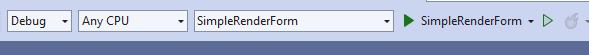
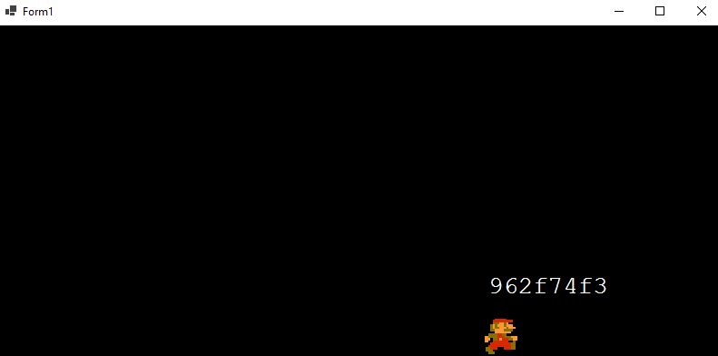
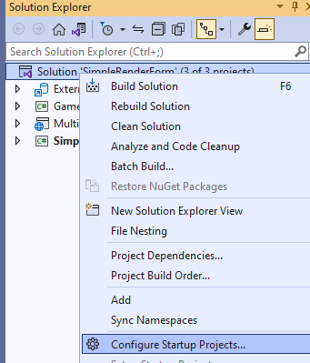
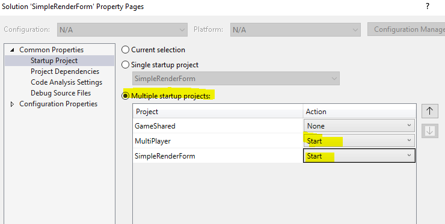
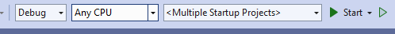
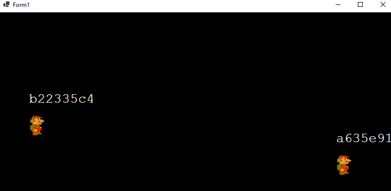

## NOTE:

1) dit is niet de mooiste code, het netwerk gedeelte blokkeerd de main thread als het internet traag is. Wat framelag kan opleveren. 
Daar had ik even geen tijd voor ^^, je kan met threading dit oplossen
2) omdat dit een asp project als server gebruikt heb je een host nodig als je dit echt wil gebruik. Vaak gebruik je een virtual server of bv de azure of aws cloud hiervoor
Het kan niet in de ma-cloud helaas.

## Inlezen

Open de solution `SimpleRenderForm.sln` en kijk er even in rond. Er zitten meerdere projecten in.

Bekijk de projecten, welke ken je al?

- Kijk eens naar wat er gaat runnen als je `start` klikt
- Dit is alleen `SimpleRenderForm.csproj` een `exe` project

- mario staat stil, dit komt omdat de server nog niet `runt`

- wij willen `MultiPlayer` & `SimpleRenderForm` tegelijk kan opstarten, dit kan in visual studio

- op de solution doe je een `rigth-click` dan `configure startup projects`
- pas het aan zodat het er zo uitziet (in geel is wat je moet aanpassen)

- Kijk eens naar wat er gaat runnen als je `start` klikt

- nu loopt mario als het goed is!

Vragen:
- wat betekent een `exe` project ook al weer?

## Meer dan 1 mario

- als je `start` hebt geclicked heb je 1 window met mario
- kijk eens hoe je nog een window kan opstarten. 
`Hint: staat ergens in het right-click-menu van het form project`
- zie je nu meerdere marios verschijnen in beide windows?

## Hoe het werkt

wat hier gebeurt is dat we 1 `webapi` hebben in het `exe` project van MultiPlayer.
Dit is een `asp core web api project`.

Als de server aanstaat houdt deze bij in zijn geheugen welke players er zijn en waar.
- Kijk in `GameController.cs` of je kan zien waar de player state wordt bijgehouden.
`het is wel een snelle hack en zou beter opgelost moeten worden`

- Het project `SimpleRenderForm` gebruikt `HttpRequests` om  zijn eigen player bij te werken (`POST`) en de andere op te halen (`GET`).
- zoek uit waar dit gebeurt!

## Library & shared code

Bekijk nu `GameShared` dit is een `library project` waar een data class in zit: `Player`

`MultiPlayer` & `SimpleRenderForm` kunnen alle twee deze class gebruiken.

Dat zit in `public`.

- zoek op het internet uit hoe je met `c#` `references` van een project kan bekijken en hoe `libraries` werken
- kijk hoe dat in dit project werkt, zoek uit in welk menu je libraries kan toevoegen en beheren 
- !! het is `niet` het `nuget` menu

## Aanpassen

- Mario kan alleen nog naar links lopen
- open `RenderForm.cs`, krijg je de designer en geen code? zoek het uit hoe je bij de code komt!
- zoek waar mario op het `keyboard` reageerd, dit lijkt een beetje op `javascript events` of `unity keyevents`
- breidt dit uit naar `4` richtingen!

## Color my name

- laten we nu de namen van de spelers in andere kleuren laten tekenen.
- Zoek uit hoe dit moet, dit is een beetje zoals in `javascript canvas` en `python turtle`
- Dit moet in `RenderForm.cs` gebeuren.

## Data stream adjustments captain!

- Breidt `Player.cs`uit om ook de kleur mee te geven
- geef bij het aanmaken van myPlayer ook een kleur op, random!
- lees die en neem die over bij het ophalen van de andere spelers

## Extra

- Kan jij mario ook laten stoppen als je een Key loslaat? daar heb je een andere `keyevent` voor nodig
- Kan jij muren toevoegen?
- Kijk eens of je hier een kleine game van kan maken